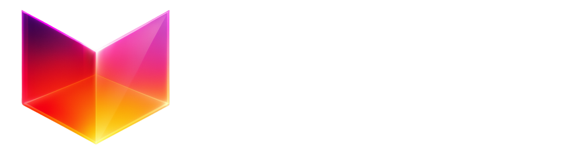

# Delta XR - Immersive 3D E-Commerce Platform

A cutting-edge web-based XR (Extended Reality) shopping platform that transforms traditional e-commerce into immersive 3D experiences. Built with React Three Fiber, TypeScript, and integrated with Shopify for seamless commerce operations.



## 🌟 Overview

Delta XR revolutionizes online shopping by creating photorealistic 3D environments where customers can explore products in immersive virtual spaces. The platform supports multiple brand environments, real-time 3D product visualization, and seamless Shopify integration for a complete e-commerce solution.


### 🎯 Key Features

- **🏪 Multiple Virtual Environments**: 15+ unique 3D store environments (Sovereign Atrium, Silken Hall, Arcade Zone, etc.)
- **📱 Cross-Platform Compatibility**: Optimized for desktop and mobile with touch controls and joystick navigation
- **🛍️ Shopify Integration**: Full product catalog sync, cart management, and checkout flow
- **🎮 Interactive Controls**: First-person navigation with WASD/touch controls and pointer lock
- **🎨 Dynamic Brand Customization**: Multi-tenant architecture supporting different brands and themes
- **📦 3D Product Models**: Support for GLB/GLTF models with KTX2 texture compression
- **🔍 Advanced Search**: Fuzzy search with spatial navigation to products
- **🎵 Audio Experience**: Ambient audio and sound effects for immersive shopping
- **⚡ Performance Optimized**: Basis Universal texture compression and efficient asset loading

## 🏗️ Architecture

### Tech Stack

**Frontend Core:**
- **React 18** with TypeScript for component architecture
- **React Three Fiber** for 3D rendering and Three.js integration
- **React Three Drei** for 3D utilities and helpers
- **React Three Rapier** for physics simulation
- **Vite** for fast development and optimized builds

**State Management:**
- **Zustand** for lightweight, scalable state management
- Modular stores for different concerns (products, environment, UI, etc.)

**Styling & UI:**
- **Material-UI (MUI)** with Joy UI components
- **SCSS** for custom styling and responsive design
- **Emotion** for CSS-in-JS styling

**3D & Graphics:**
- **Three.js** for WebGL rendering
- **GSAP** for smooth animations and transitions
- **Basis Universal** for texture compression
- **KTX2** texture format support

**E-Commerce Integration:**
- **Shopify Storefront API** for product data
- **Shopify Buy SDK** for cart and checkout operations
- Custom API layer for brand and environment management

**Additional Libraries:**
- **Fuse.js** for fuzzy search functionality
- **Driver.js** for guided tours and onboarding
- **SweetAlert2** for elegant notifications
- **Canvas Confetti** for celebration effects
- **NippleJS** for mobile joystick controls

### 📁 Project Structure

```
src/
├── api/                    # API services and integrations
│   ├── brandService.ts     # Brand data management
│   ├── shopifyAPIService.ts # Shopify integration
│   ├── envStoreService.ts  # Environment data service
│   └── cloudUtil.ts        # Cloud function utilities
├── data/                   # Static data and configurations
│   └── environment/        # Environment-specific data
│       ├── environmentModel/ # 3D environment models
│       └── placeHolderData/ # Product placement data
├── stores/                 # Zustand state management
│   └── ZustandStores.ts    # All application stores
├── Types/                  # TypeScript type definitions
│   ├── Product.tsx         # Product data types
│   └── Variant.tsx         # Product variant types
├── UI/                     # User interface components
│   ├── Components/         # Reusable UI components
│   └── UI.tsx             # Main UI orchestrator
├── world/                  # 3D world components
│   ├── App.jsx            # Main 3D scene
│   ├── Player.jsx         # First-person controller
│   ├── Products.jsx       # 3D product rendering
│   ├── Lights.jsx         # Scene lighting
│   └── CameraController.jsx # Camera management
└── main.tsx               # Application entry point
```

## 🚀 Getting Started

### Prerequisites

- **Node.js** (v18 or higher)
- **npm** or **yarn**
- Modern browser with WebGL 2.0 support

### Installation

1. **Clone the repository:**
   ```bash
   git clone <repository-url>
   cd delta-xr
   ```

2. **Install dependencies:**
   ```bash
   npm install
   ```

3. **Start development server:**
   ```bash
   npm run dev
   ```

4. **Build for production:**
   ```bash
   npm run build
   ```

5. **Preview production build:**
   ```bash
   npm run preview
   ```

### 🔧 Configuration

The application uses a multi-tenant architecture where brands are identified by subdomain:

```
https://[brand-name].shackit.com
https://[brand-name].shackit.in
```

Brand configuration includes:
- Shopify store credentials
- 3D environment selection
- Custom branding assets
- Product placement data

## 🎮 Usage

### Navigation Controls

**Desktop:**
- **WASD** - Move around the environment
- **Mouse** - Look around (pointer lock enabled)
- **Click** - Interact with products
- **ESC** - Exit pointer lock

**Mobile:**
- **Virtual Joystick** - Movement control
- **Touch & Drag** - Camera rotation
- **Tap** - Product interaction
- **Pinch** - Zoom (where applicable)

### Features

1. **Environment Exploration**: Navigate through photorealistic 3D store environments
2. **Product Interaction**: Click on products to view details, images, and 3D models
3. **Shopping Cart**: Add products to cart and proceed to Shopify checkout
4. **Search**: Use the search function to locate specific products
5. **Settings**: Customize audio, controls, and performance settings

## 🏪 Supported Environments

The platform supports 15+ unique 3D environments:

- **Sovereign Atrium** - Luxury retail space
- **Silken Hall** - Elegant fashion boutique
- **Arcade Zone** - Gaming-themed store
- **Glowbar** - Modern cosmetics environment
- **Luxe Cradle** - Premium product showcase
- **Garden Atelier** - Nature-inspired space
- **Indigo Chamber** - Sophisticated dark theme
- **Auto Haven** - Automotive showroom
- **Kids Store** - Child-friendly environment
- **Cocktail Den** - Bar and beverage theme
- And more...

Each environment features:
- Custom 3D models and textures
- Optimized lighting setups
- Strategic product placement zones
- Unique ambient audio

## 🛠️ Development

### State Management

The application uses Zustand for state management with the following stores:

- **ComponentStore**: UI state, modals, product selection
- **EnvironmentStore**: Current environment and settings
- **BrandStore**: Brand-specific data and configuration
- **EnvProductStore**: Product placement and 3D positioning
- **EnvAssetStore**: Environment assets and decorations

### API Integration

**Shopify Integration:**
```typescript
// Fetch products from Shopify
const products = await ProductService.getAllProducts(brandName, brandData);

// Add to cart
const checkout = await ShopifyBuy.checkout.addLineItems(checkoutId, lineItems);
```

**Brand Management:**
```typescript
// Fetch brand configuration
const brandData = await BrandService.fetchBrandData(brandName);
```

### 3D Model Loading

The platform supports optimized 3D model loading:

```typescript
// Preload models with KTX2 compression
useGLTF.preload('/models/environment.glb');

// Load with Basis Universal support
const { scene } = useGLTFWithKTX2('/models/product.glb');
```

### Performance Optimization

- **Texture Compression**: Basis Universal and KTX2 formats
- **Model Optimization**: GLTF pipeline for asset compression
- **Lazy Loading**: Progressive asset loading based on user interaction
- **Memory Management**: Automatic cleanup of unused resources

## 🎨 Customization

### Adding New Environments

1. Create 3D model in Blender/Maya (GLB format recommended)
2. Add environment component in `src/data/environment/environmentModel/`
3. Configure lighting and camera settings
4. Add placeholder data for product positioning
5. Update environment data configuration

### Brand Integration

1. Configure brand data in the backend system
2. Set up Shopify store connection
3. Upload brand assets (logo, poster, audio)
4. Configure environment selection
5. Set up product placement data

## 📱 Mobile Optimization

The platform is fully optimized for mobile devices:

- **Touch Controls**: Intuitive touch navigation
- **Virtual Joystick**: Customizable joystick positioning
- **Performance Scaling**: Automatic quality adjustment
- **Responsive UI**: Adaptive interface for different screen sizes
- **Battery Optimization**: Efficient rendering for mobile GPUs

## 🔒 Security & Privacy

- **HTTPS Only**: All communications encrypted
- **Shopify Secure Checkout**: PCI compliant payment processing
- **Data Privacy**: Minimal data collection, GDPR compliant
- **Content Security**: CSP headers and XSS protection

## 📊 Analytics & Monitoring

- **Google Analytics**: User behavior tracking
- **Lucky Orange**: Session recording and heatmaps
- **Performance Monitoring**: WebGL performance metrics
- **Error Tracking**: Comprehensive error boundary system

## 🚀 Deployment

The application is optimized for deployment on:

- **Vercel** (recommended)
- **Netlify**
- **AWS CloudFront**
- **Google Cloud Platform**

Build optimization includes:
- Tree shaking for minimal bundle size
- Asset compression and optimization
- CDN-ready static assets
- Progressive Web App capabilities

## 🤝 Contributing

1. Fork the repository
2. Create a feature branch (`git checkout -b feature/amazing-feature`)
3. Commit your changes (`git commit -m 'Add amazing feature'`)
4. Push to the branch (`git push origin feature/amazing-feature`)
5. Open a Pull Request

### Development Guidelines

- Follow TypeScript best practices
- Use ESLint and Prettier for code formatting
- Write comprehensive tests for new features
- Optimize 3D assets before committing
- Document new APIs and components

## 📄 License

This project is proprietary software. All rights reserved.

## 🆘 Support

For technical support or questions:
- Create an issue in the repository
- Contact the development team
- Check the documentation wiki

---

**Built with ❤️ by the Delta XR Team**
